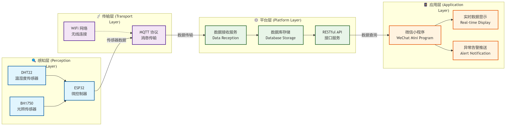
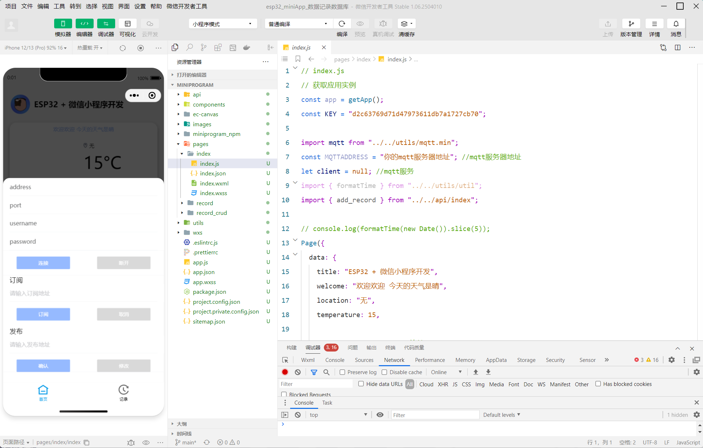
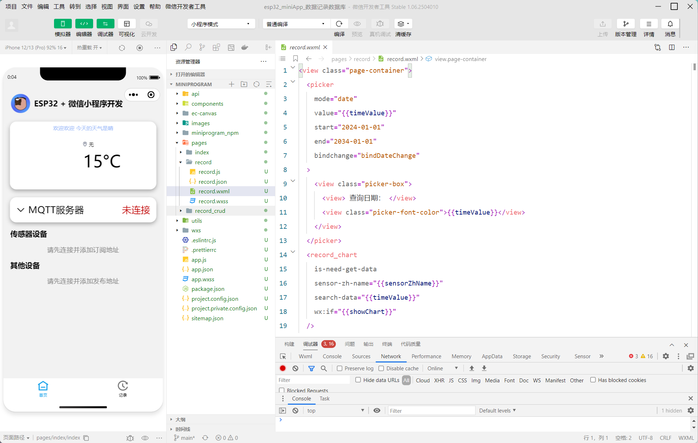

# smart-incubator-monitor
A smart IoT monitoring system for lab incubation racks, built with ESP32, MQTT, and a mini-program. Enables real-time temperature, humidity, and light sensing with instant alerts to prevent experimental loss during unattended operation.

## 项目背景

在实验室环境中，培养架需要稳定的温湿度与光照条件。然而，传统人工巡检无法实现 24 小时值守，一旦环境异常（如空调关闭、加湿器缺水），极易造成实验样本损失。

本项目通过 **ESP32 + 传感器 + MQTT + 小程序** 构建一套低成本、高可用的物联网监控系统，实现：
- ✅ 环境参数实时采集
- ✅ 异常状态即时告警
- ✅ 远程可视化查看
- ✅ 防止无人值守期间的实验中断

---
## 系统架构
本系统采用经典的四层物联网架构：

**架构图**  


---
## 技术栈
| 层级 | 技术 |
|------|------|
| **主控** | ESP32 |
| **传感器** | DHT22（温湿度）、BH1750（光照强度） |
| **通信协议** | MQTT（适应弱网）、WiFi |
| **后端服务** | Node JS + RESTful API（Flask） |
| **数据存储** | MySQL |
| **前端应用** | 微信小程序（WXML + WXSS + JavaScript） |

---
## 核心功能
- 实时采集温湿度、光照强度数据（每 30 秒一次）
- 异常告警：超出阈值时，通过小程序推送通知
- 小程序端可视化：历史数据曲线、当前状态面板
- 数据持久化：累计采集 12 万+ 条数据，支持回溯分析
- 低功耗设计：适应长时间运行
---

## 项目结构
```bash
smart-incubator-monitor/
├── docs/               # 项目文档（需求、设计、部署）
├── firmware/           # ESP32 固件代码
├── backend/            # 后端服务与数据处理
├── frontend/           # 微信小程序代码
├── tests/              # 测试用例与验证记录
├── assets/             # 架构图、照片、图标
├── README.md
└── LICENSE
```

---
## 项目示例
前端小程序


